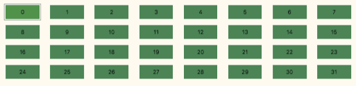
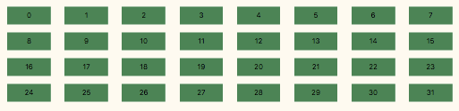

# gridnav.js - allow for more convenient keyboard navigation of lists

I AM STILL WRITING THIS!





In [the first demo](https://codepo8.github.io/gridnav/#list) we define the amount of elements per row and which element is the one that should get keyboard navigation. In this case, eight items and buttons as elements. You define these as ```data attributes``` in your HTML:

```xml
<ul id="list" data-amount="8" data-element="button">
  <li><button>0</button></li>
  <li><button>1</button></li>
  <li><button>2</button></li>
  …
  <li><button >31</button></li>
</ul>
```
You then add keyboard grid navigation by giving gridnav the selector of the element as a parameter:

```javascript
var buttonlist = new Gridnav('#list');
```

You don't need an ID on the element, any selector that points to the right element will do, for example:

```javascript
var buttonlist = new Gridnav('.demo ul');
```

[The second demo](https://codepo8.github.io/gridnav/#links) uses links and five elements per row.

```xml
<ul id="links" data-amount="5" data-element="a">
  <li><a href="#">1</a></li>
  <li><a href="#">2</a></li>
…
  <li><a href="#">25</a></li>
</ul>
```

You enable it by instantiating ```gridnav``` once more:

```javascript
var linklist = new Gridnav('#links');
```

Defining the amount of elements per row and the element that is keyboard accessible makes it faster and easier to add the functionality. You can however also omit those like in the [third demo](https://codepo8.github.io/gridnav/#smaller). In this case, ```gridnav``` detects the interactive element as the first child node of the first child of the list and calculates the amount of elements automatically.

```xml
<ul id="smaller">
  <li><a href="#">1</a></li>
  <li><a href="#">2</a></li>
…
  <li><a href="#">25</a></li>
</ul>
```
```javascript
var smalllist = new Gridnav('#smaller');
```
> :warning: Whilst this is a lot easier, it is also more expensive and may result in errors. ```gridnav``` calculates the amount of elements by reading the width of the list element and one of its child elements and dividing them. This means you need to ensure that your list items are all the same width and the script needs to recalculate on every window resize.

